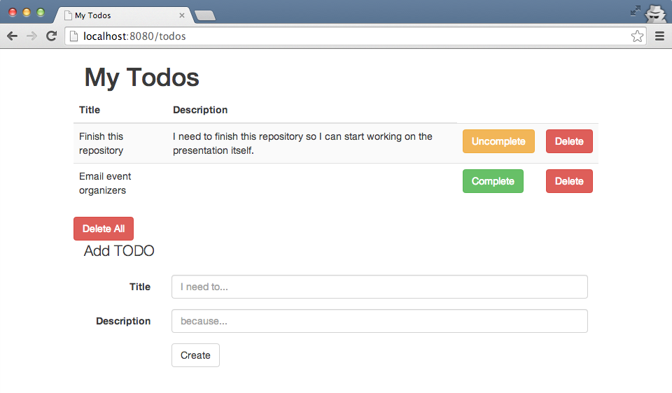

# Todo-it

Todo-it is a sample Pedestal application developed from scratch. Read more information below, or in the accompanying [slides](https://speakerdeck.com/rkneufeld/web-apps-on-a-pedestal).

## Usage

### Pre-requisites

* Install [JDK 7+](http://bit.ly/java-download)
* Install the [Leiningen build tool](http://leiningen.org/#install)
* Clone this repository (`git clone https://github.com/rkneufeld/pedestal-workshop`)

### Running the application

Inside `pedestal-workshop/`, run the command `lein run`. The first
time you run this command Leiningen will fetch and install all of the
application's dependencies.

Once the application starts, you will see something like the following:

```sh
$ lein run
INFO  org.eclipse.jetty.util.log - Logging initialized @10299ms
INFO  org.eclipse.jetty.server.Server - jetty-9.1.3.v20140225
INFO  o.e.j.server.handler.ContextHandler - Started o.e.j.s.ServletContextHandler@6d0433ee{/,null,AVAILABLE}
INFO  o.e.jetty.server.ServerConnector - Started ServerConnector@32af198c{HTTP/1.1}{0.0.0.0:8080}
INFO  org.eclipse.jetty.server.Server - Started @10431ms
```

At this point, the application is ready. Visit or cURL
<http://localhost:8080/hello> to verify the application is running
properly (all but the very first commit should respond).

If you've built or checked-out the final version of the application, visit <http://localhost:8080/todos> to see it in action.



### Following along with the workshop

The slides for following along with this workshop are available at <https://speakerdeck.com/rkneufeld/web-apps-on-a-pedestal>.

Branches exist for each exercise, allowing you to `git checkout
checkpoint-x` and start with a clean, working state.

Checkpoint branches are:

* [exercise-1](../../tree/exercise-1) - Basic application with only [/hello](localhost:8080/hello)
* [exercise-2](../../tree/exercise-2) - [/hello?name=You!](localhost:8080/hello?name=you!)
* [exercise-3](../../tree/exercise-3) - Heroku deployable application
* [exercise-4](../../tree/exercise-4) - Transient persistence via in-memory Datomic ([todoit.todo.db](src/todoit/todo/db.clj))
* [exercise-5](../../tree/exercise-5) - [/todos](localhost:8080/todos) with a stubbed TODO form
* [exercise-6](../../tree/exercise-6) - Bootstrap paint job!
* [exercise-7](../../tree/exercise-7) - Finally, [/todos](localhost:8080/todos) can create, read, update, and destroy TODOs.

## License

Copyright © 2014 Ryan Neufeld

Distributed under the Eclipse Public License either version 1.0 or (at
your option) any later version.
